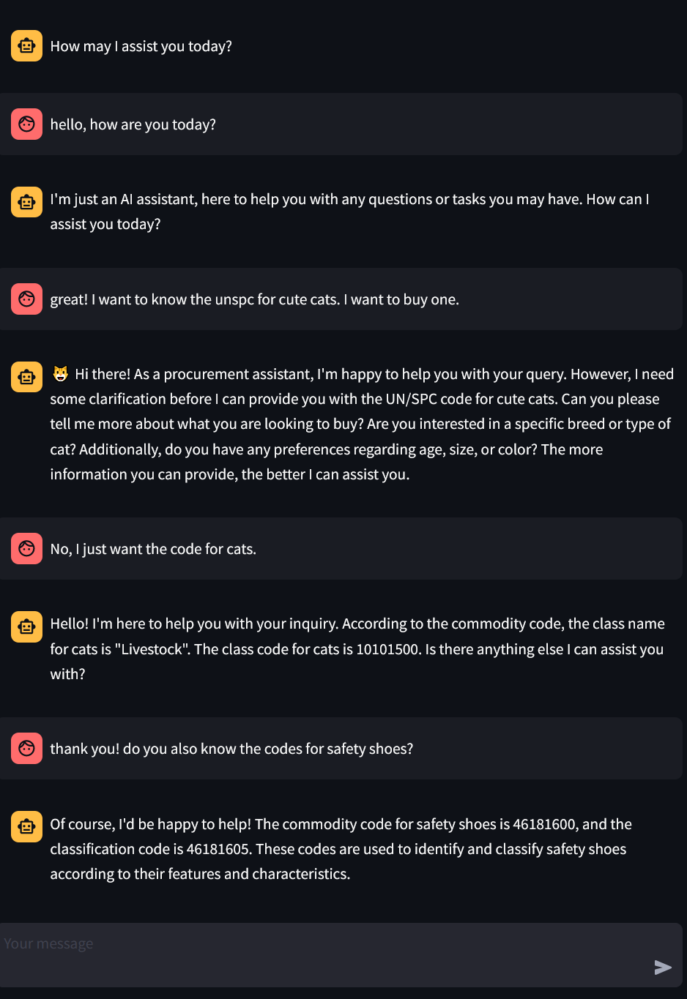

# Procurement Chatbot with Memory using Llama-2-7B-Chat for UNSPC chats.
 


## Table of Contents

- [Introduction](#introduction)
- [Setup Instructions](#setup-instructions)
- [How it works](#how-it-works)
- [Prerequisites](#prerequisites)
- [Installation](#installation)
- [Usage](#usage)
- [Docker Compose](#docker-compose)
- [limitations](#limitations)
- [Acknowledgments](#acknowledgments)

## Introduction

This is a llama-based procurement chatbot that helps with unspc codes. 

The chatbot integrates unspc data from [data.gov](https://catalog.data.gov/dataset/unspsc-codes-93778)

## Setup Instructions

The repository contains all the necessary code and files to set up and run the Procurement Chatbot with Memory using the Llama-2-7B-Chat model. Here's a brief overview of  how to set it up:

- `app.py`: The Streamlit web application code that allows users to interact with the chatbot through a simple user interface.

- `llama-2-7b-chat.ggmlv3.q2_K.bin`:  Quantized model weights provided by TheBloke.  Can be downloaded via wget or manually  

```
!wget https://huggingface.co/TheBloke/Llama-2-7B-Chat-GGML/resolve/main/llama-2-7b-chat.ggmlv3.q2_K.bin
```

Please keep the downloaded model inside the data/ folder

- `Dockerfile`: The Dockerfile used to containerize the application for easy deployment and management.

- `docker-compose.yml`: A Docker Compose file that simplifies the deployment of the chatbot with memory as a Docker container.

- `requirements.txt`: Contains a list of Python dependencies required to run the application.

## How it works

The Procurement Bot is a retrieval augmented generation (RAG) based chatbot. The workflow is as follows:

1. The user types the query to the bot.
2. The relevant entity is extracted (as noun-phrases using spacy) and matched with the entities in the UNSPC database.
3. Based on the detected entity, a relevant triple is extracted from the Database and fed to the llama model for creating a response using the data.

A sample conversation with the bot is shown below:

## Prerequisites

Before running the Streamlit Chatbot with Memory, you need to have the following installed:

1. Python (version 3.6 or higher)
2. Conda
3. Docker (if you plan to use the Docker Compose setup)

## Installation

To set up the chatbot locally, follow these steps:

1. Copy the folder into local machine and go to the folder procurement-bot

```bash
cd procurement-bot
```

2. Create a conda environment and activate it:

```bash
conda create -n procu-bot python=3.10
conda activate procu-bot
```

3. Install the required Python packages:

```bash
pip install -r requirements.txt
```
4. Install the spacy model for detecting noun phrases

```bash
python -m spacy download en_core_web_sm
```
## Usage

To run the Procurement Chatbot for unspc, execute the following command:

```bash
streamlit run app.py
```

This will start the Streamlit server, and you can access the chatbot interface by opening your web browser and navigating to `http://localhost:8501`.

Simply type your messages (preferably about unspc codes) in the input box and press "Enter" to send them to the chatbot. The chatbot will respond based on the context of the conversation, thanks to its memory capabilities.

## Docker Compose

If you prefer to deploy the chatbot using Docker Compose, follow these steps:

1. Make sure you have Docker and Docker Compose installed on your system.

2. Start the container using Docker Compose:

```bash
docker-compose up -d
```

The chatbot will be accessible at `http://localhost:8501` in your web browser.

## Limitations

1. The main limitations of the bot is it is very much domain-specific and goal-oriented but can also have some chit-chats with the user
2. The entity detection relies on direct matching the entities in the unspc dataset, hence can't work on entities with spelling mistakes or needing partial matches.
3. There is no controlled intent recognition hence the responses can be at times not consistent.
4. The query is based on shallow parsing and has no deep semantic understanding whatsoever.


## Acknowledgments

- Streamlit Chatbot code credits go to [streamlit-llama](https://github.com/talhaanwarch/streamlit-llama/tree/main) and [data professor](https://github.com/dataprofessor/streamlit_chatbot).

- Quantized GGML version of Llama-2-7B-Chat credits go to [TheBloke](https://huggingface.co/TheBloke/Llama-2-7B-Chat-GGML).
